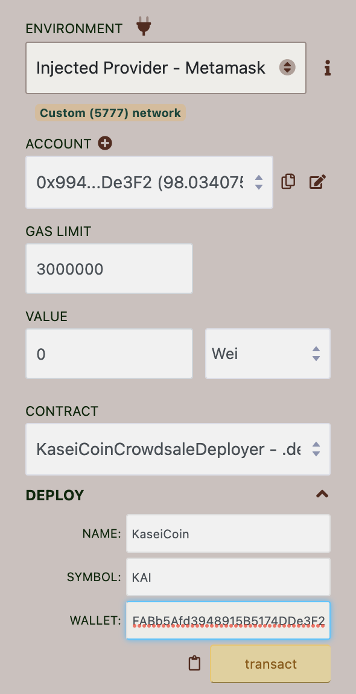
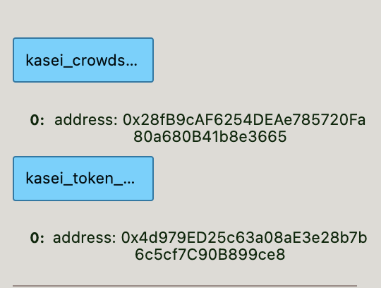
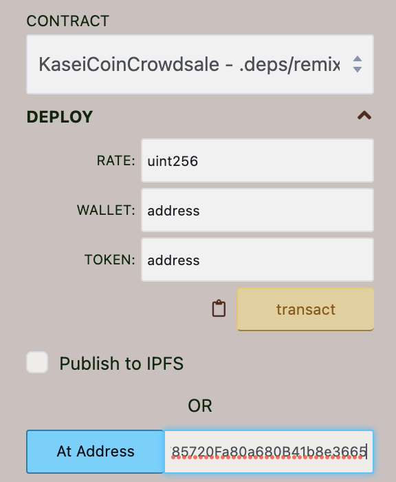
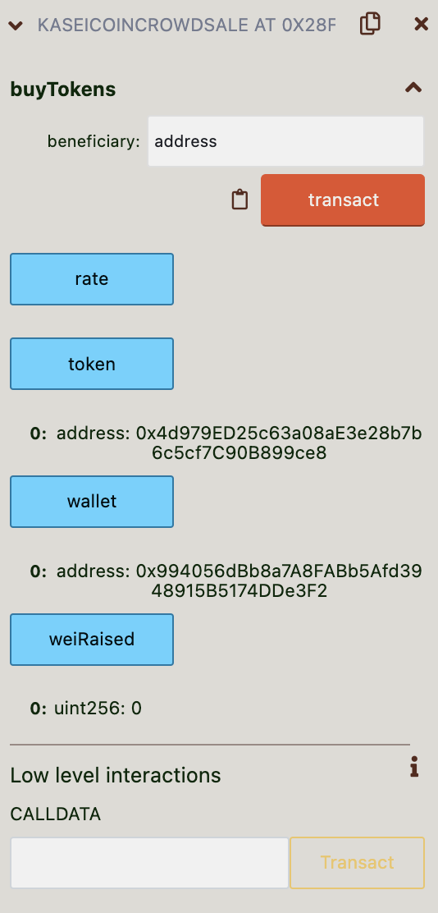
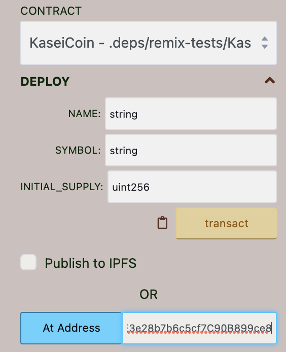
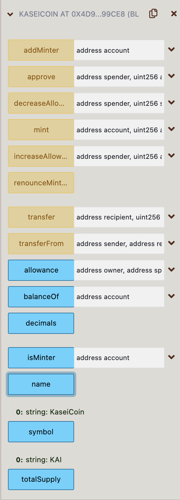
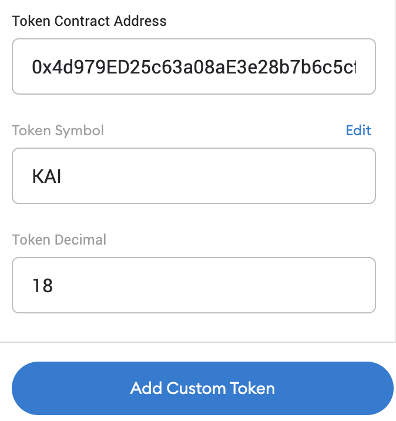
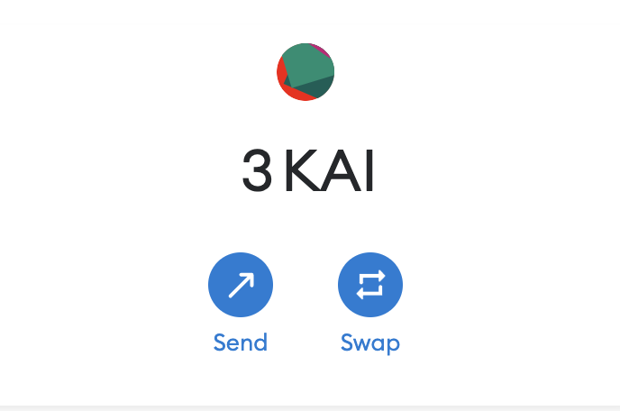

# User Friendly Ledger

> KaiSeiCoin is an ERC-20 Token
* [Crowdsale Deployment](#crowdsale-deployment)
* [Crowdsale](#crowdsale)
* [KaiSeiCoin](#kaiseicoin)
* [Adding KaiSeiCoin to MetaMask](#adding-kaiseicoin-to-metamask)

---

## Technologies

Solidity version ^0.5.0 
* [Remix IDE](https://remix-project.org/)
* [OpenZeppelin](https://www.openzeppelin.com/)

---

## Crowdsale Deployment
> **In the demonstrations, MetaMask is used as the injected Provider**

Using the CrowdsaleDeployer contract, the name and symbol of the token are entered. The address entered will be the wallet that will recieve the funds from the crowdsale. **CrowdsaleDeployer returns the address of the created crowdsale address of the token and the token's address itself.

---

## Crowdsale

Using the address from the CrowdsaleDeployer contract the KaiSeiCoinCrowdsale will be dployed. **Wallets can purchase KaiSeiCoin by using an address as the benificiary effecting the *weiraised*.** The wallet that was used for CrowdsaleDeployer is the wallet on display. 

---

## KaiSeiCoin

**The KaiSeiCoin itself is a standard ERC-20 token** that inherits the OpenZepplin's ERC20, ERC20Detailed, and ERC20Mintable contracts. It includes everything expected from the ERC-20 standard.

---

## Adding KaiSeiCoin to MetaMask
> **The contract was deployed on a local host in examples.**

First enter the address of the token. You can get the address from veiwing *token* in the deployed KaiseiCoinCrowdsale contract or *kaisei-token-address* in the deployed KaiseiCoinCrowdsaleDeployer contract. The information should autofill but just in case **KAI** will be the symbol and **18 token decimals** is the standard. **If a devolper changes the symbol when deployed they will get a different symbol result.**

As a result a user can now see how much KaiSeiCoin they have in there wallet. 

---

## Contributors

Main contributer **Santiago Hernandez**
- [dsmannight@gmail.com](dsmannight@gmail.com)

---

## License

This application is free for non-profit use.
